# BACO — Bug Analysis & Cross-reference Orchestrator

A research-backed SAST scanner that augments static analysis with LLM-powered
discovery across a 24-phase pipeline: semgrep → CWE-aware MoE routing →
LLM verification → exploit synthesis → ticket cross-referencing → auto-patching.
Grounded in 36 surveyed papers (16 integrated) from [Awesome-LLMs-for-Vulnerability-Detection](https://github.com/huhusmang/Awesome-LLMs-for-Vulnerability-Detection).

[](https://github.com/CodeAtCode/baco-scanner/actions/workflows/ci.yml)
[](https://app.codecov.io/gh/CodeAtCode/baco-scanner)
[](https://www.gnu.org/licenses/gpl-3.0)
[](https://www.rust-lang.org)

[](example-report.html)

---

## Prerequisites

- **Rust** 1.74+ (`rustup`)
- **An LLM API key** (Mistral, OpenAI, or any OpenAI-compatible endpoint)
- **Semgrep** installed on PATH (`pip install semgrep` or [see install options](https://semgrep.dev/docs/getting-started/))

## Quick Start

Five steps from clone to first scan:

```bash
# 1. Install baco (build from source)
git clone https://github.com/CodeAtCode/baco-scanner.git
cd baco-scanner
cargo build --release

# 2. Install semgrep (required for static analysis)
pip install semgrep

# 3. Set your LLM API key
export MISTRAL_API_KEY="your-key-here"

# 4. Configure and scan
cp config.example.toml my-config.toml
# Edit my-config.toml: set [project] path to your target code
./target/release/baco scan --config my-config.toml

# 5. View the report
open baco-output/report.html
```

### What happens next

- **24 phases run**: 3 parallel (Indexing, Semgrep, LLM Static), 21 sequential — see [Architecture](docs/architecture.md)
- **Output in `baco-output/`**: `findings.json`, `report.html`, `report.sarif`
- **Resume interrupted scans**: `./target/release/baco resume --checkpoint baco-output/checkpoint.json`

## Features

- **24-phase pipeline**: Indexing → Semgrep → CWE Routing → LLM Static Analysis → LLM Discovery → LLM Verification → Validate → SecurityAgent Verification → Ticket Cross-Ref → Git Analysis → Cross-File Analysis → Confidence Scoring → AI Aggregation → Threat Modeling → Root Cause Dedup → Multi-Verifier → Auto-Patching → CVE Bootstrap → PoC Compiler → Variant Search → Reporting
- **Parallel execution**: Indexing, Semgrep, and LLM Static Analysis run concurrently; 21 sequential phases follow
- **CWE-aware MoE**: BM25 RAG retrieval from CWE knowledge base, routes to specialized analysis paths
- **Research-backed**: 16 academic papers integrated (VulTriage, VulIn, MoCQ, MoEVD, AgentFlow) — see [Research Integration](docs/research-integration.md)
- **Checkpoint/resume**: Crash recovery after each phase
- **Multiple outputs**: JSON, HTML, SARIF
- **Config-driven**: TOML config with env var overrides
- **Ticket integration**: GitHub, GitLab, Bugzilla, Jira

## Supported Languages

| Language   | Static analysis          | LLM analysis |
| ---------- | ------------------------ | ------------ |
| C / C++    | tree-sitter + semgrep    | ✅           |
| Rust       | tree-sitter + semgrep    | ✅           |
| Python     | tree-sitter + semgrep    | ✅           |
| JavaScript | tree-sitter + semgrep    | ✅           |

## Outputs

- `findings.json` — complete vulnerability data (all fields, machine-readable)
- `report.html` — interactive report with severity filtering, code highlighting, confidence/CWE badges
- `report.sarif` — SARIF 2.1 for CI/CD integration (GitHub Code Scanning, Azure DevOps)

## Architecture

```mermaid
flowchart LR
    subgraph Parallel["Parallel Detection"]
        direction TB
        A1[Indexing] --> A2[Semgrep] --> A3[LLM Static]
    end

    subgraph Discovery["Sequential Discovery"]
        direction TB
        B1[CWE Routing] --> B2[LLM Discovery] --> B3[LLM Verification]
    end

    subgraph Triage["Triage"]
        direction TB
        C1[SecurityAgent Verify] --> C2[Ticket Cross-Ref] --> C3[Git Analysis] --> C4[Cross-File] --> C5[Confidence]
    end

    subgraph Aggregation["Aggregation"]
        direction TB
        D1[AI Aggregation] --> D2[Threat Modeling]
    end

    subgraph PostProcessing["Post-Processing"]
        direction TB
        E1[Root Cause Dedup] --> E2[Multi-Verifier] --> E3[Auto-Patch] --> E4[CVE Bootstrap] --> E5[PoC Compiler] --> E6[Variant Search]
    end

    subgraph Output["Output"]
        direction TB
        F1[Reporting]
    end

    A3 --> B1
    B3 --> C1
    C5 --> D1
    D2 --> E1
    E6 --> F1
```



See [Architecture](docs/architecture.md) for the full PhaseGraph pipeline and data flow.

## Research Foundation

BACO integrates 16 papers from the [Awesome-LLMs-for-Vulnerability-Detection](https://github.com/huhusmang/Awesome-LLMs-for-Vulnerability-Detection) survey. Each integration is behind a config flag (default disabled) so users can opt in.

| Category | Papers | Integration |
|----------|--------|-------------|
| Agentic & Multi-Agent | Sifting the Noise, AutoCVE, Cloudflare Security-Audit-Skill | Triage filter, multi-agent deduplication, parallel verification |
| Context & Program Analysis | Context-Enhanced VD, VulIn (BM25 RAG), VulTriage, LLMxCPG | Triple-path context, BM25 retrieval, CPG-guided slicing |
| Rule Synthesis & Exploit Gen | MoCQ, QRS | LLM-driven semgrep rule synthesis, adversarial validation |
| Model Specialization & Routing | MoEVD, R2Vul + VULPO | Per-CWE MoE routing, specialized reasoning models |
| Quality & Evaluation | SV-TrustEval-C, CORRECT, SecVulEval, PrimeVul | Regression suite, rationale validation, statement-level scoring, dataset hygiene |
| Confidence & Calibration | Closing the Gap | Post-hoc normalization, confidence calibration |

See [Research Integration](docs/research-integration.md) for detailed integration notes and [Paper Survey](docs/llm-vuln-detection-papers-survey.md) for the full 36-paper survey.

## Documentation

| Document | What it covers |
| --- | --- |
| [Architecture](docs/architecture.md) | The 20-phase pipeline, PhaseGraph, data flow |
| [Configuration](docs/configuration.md) | All config options, LLM setup, phase flags, prompt overrides |
| [Research Integration](docs/research-integration.md) | The 16 papers integrated into baco, each with technique and result |
| [Paper Survey](docs/llm-vuln-detection-papers-survey.md) | Full survey of 36 papers; the 5 selected for P1–P5 integration |
| [Roadmap](todo.md) | Completed P1–P5 paper-integration tracks and pending work |

## Acknowledgements

Sponsored and tested with [Regolo.AI](https://regolo.ai/) — LLM API services.
