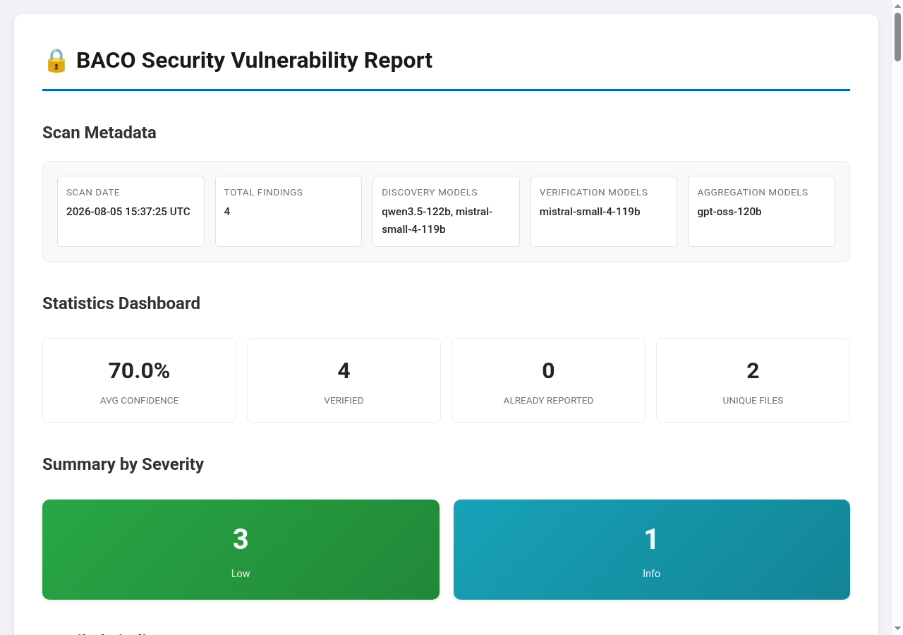

# BACO — Bug Analysis & Cross-reference Orchestrator

A research-backed SAST scanner that augments static analysis with LLM-powered
discovery across a 24-phase pipeline: semgrep → CWE-aware MoE routing →
LLM verification → exploit synthesis → ticket cross-referencing → auto-patching.
Grounded in 36 surveyed papers (16 integrated) from [Awesome-LLMs-for-Vulnerability-Detection](https://github.com/huhusmang/Awesome-LLMs-for-Vulnerability-Detection).

[](https://github.com/CodeAtCode/baco-scanner/actions/workflows/ci.yml)
[](https://app.codecov.io/gh/CodeAtCode/baco-scanner)
[](https://www.gnu.org/licenses/gpl-3.0)
[](https://www.rust-lang.org)

[](example-report.html)

---

## Prerequisites

- **Rust** 1.74+ (`rustup`)
- **An LLM API key** (Mistral, OpenAI, or any OpenAI-compatible endpoint)
- **Semgrep** installed on PATH (`pip install semgrep` or [see install options](https://semgrep.dev/docs/getting-started/))

## Quick Start

Five steps from clone to first scan:

```bash
# 1. Install baco (build from source)
git clone https://github.com/CodeAtCode/baco-scanner.git
cd baco-scanner
cargo build --release

# 2. Install semgrep (required for static analysis)
pip install semgrep

# 3. Set your LLM API key
export MISTRAL_API_KEY="your-key-here"

# 4. Configure and scan
cp config.example.toml my-config.toml
# Edit my-config.toml: set [project] path to your target code
./target/release/baco scan --config my-config.toml

# First scan sequence:
# 1. Set your LLM API key (via env or config file)
# 2. Run the scan: ./target/release/baco scan --config my-config.toml
# 3. Open the report: baco-output/report.html
- **24 phases run**: 4 parallel (Indexing, Semgrep, CpgSlice, LlmStaticAnalysis) + 20 sequential — see [Architecture](docs/architecture.md)
- **Output in `baco-output/`**: `findings.json`, `report.html`, `report.sarif`, `checkpoint.json`
- **Checkpoint file**: The scanner writes `checkpoint.json` after each phase. Re-running the scan auto-resumes from the checkpoint; use `./target/release/baco resume --checkpoint baco-output/checkpoint.json` for manual control.

### What happens next

- **24 phases run**: 4 parallel (Indexing, Semgrep, CpgSlice, LlmStaticAnalysis) + 20 sequential — see [Architecture](docs/architecture.md)
- **Output in `baco-output/`**: `findings.json`, `report.html`, `report.sarif`
- **Resume interrupted scans**: `./target/release/baco resume --checkpoint baco-output/checkpoint.json`

## Features

- **24-phase pipeline**: Indexing → Semgrep → CpgSlice → LlmStaticAnalysis → LlmCweRouting → LlmDiscovery → LlmVerification → Validate → SecurityAgentVerification → TicketCrossRef → GitAnalysis → CrossFileAnalysis → ConfidenceScoring → AIAggregation → ThreatModeling → RootCauseDedup → MultiVerifier → AutoPatching → CveBootstrap → PocCompiler → VariantSearch → Reporting → (see [Architecture](docs/architecture.md) for full phase names)
- **Parallel execution**: Indexing, Semgrep, CpgSlice, and LlmStaticAnalysis run concurrently; 20 sequential phases follow
- **CWE-aware MoE**: BM25 RAG retrieval from CWE knowledge base, routes to specialized analysis paths
- **Research-backed**: 16 academic papers integrated (VulTriage, VulIn, MoCQ, MoEVD, AgentFlow) — see [Research Integration](docs/research-integration.md)
- **Checkpoint/resume**: Crash recovery after each phase
- **Multiple outputs**: JSON, HTML, SARIF
- **Config-driven**: TOML config with env var overrides
- **Ticket integration**: GitHub, GitLab, Bugzilla, Jira

## Supported Languages

| Language   | Static analysis          | LLM analysis |
| ---------- | ------------------------ | ------------ |
| C / C++    | tree-sitter + semgrep    | ✅           |
| Rust       | tree-sitter + semgrep    | ✅           |
| Python     | tree-sitter + semgrep    | ✅           |
| JavaScript | tree-sitter + semgrep    | ✅           |

## Outputs

- `findings.json` — complete vulnerability data (all fields, machine-readable)
- `report.html` — interactive report with severity filtering, code highlighting, confidence/CWE badges
- `report.sarif` — SARIF 2.1 for CI/CD integration (GitHub Code Scanning, Azure DevOps)

## Architecture

See [Architecture](docs/architecture.md) for the PhaseGraph pipeline diagram, full phase list, and data flow.

## Research Foundation

BACO integrates 20 academic papers from the [Awesome-LLMs-for-Vulnerability-Detection](https://github.com/huhusmang/Awesome-LLMs-for-Vulnerability-Detection) survey. Integrations span agentic workflows, context enhancement, rule synthesis, MoE routing, and confidence calibration.

See [Research Integration](docs/research-integration.md) for per-paper details (techniques, results, config flags) and [Paper Survey](docs/llm-vuln-detection-papers-survey.md) for the full 36-paper survey.

## Documentation

- [Architecture](docs/architecture.md) — PhaseGraph pipeline, all 24 phases, data flow
- [Configuration](docs/configuration.md) — Config options, LLM setup, phase flags, prompt overrides
- [Research Integration](docs/research-integration.md) — 20 integrated papers with techniques and results
- [Paper Survey](docs/llm-vuln-detection-papers-survey.md) — Full 36-paper survey
- [Operator Tuning](docs/operator-tuning.md) — Performance flags and scenario-based tuning
- [Output Interpretation](docs/output-interpretation.md) — Reading findings, confidence, triage verdicts
- [Troubleshooting](docs/troubleshooting.md) — Common errors and fixes
- [Roadmap](todo.md) — Completed and pending work

### Reading Order

Recommended for new users:
1. **README.md** (this page) — overview, quick start
2. **docs/architecture.md** — pipeline architecture
3. **docs/configuration.md** — configuration reference
4. **docs/research-integration.md** — research integrations
5. **docs/llm-vuln-detection-papers-survey.md** — paper survey
6. **docs/operator-tuning.md** — performance tuning
7. **docs/output-interpretation.md** — reading results
8. **docs/troubleshooting.md** — error fixes
9. **todo.md** — roadmap

## Acknowledgements

Sponsored and tested with [Regolo.AI](https://regolo.ai/) — LLM API services.
