# Architecture

## PhaseGraph (Data-Driven Pipeline Orchestration)

BACO uses a **data-driven PhaseGraph** (`src/scanner/pipeline/orchestrator.rs`) that defines phase execution order, dependencies, and metadata in a single source of truth. This eliminates duplication across the codebase and enables:

- **Centralized phase ordering** - All phases defined in one place with execution metadata
- **Checkpoint/resume support** - Stable phase indices for reliable restart
- **Extensibility** - New phases can be added without modifying multiple files
- **Runtime validation** - Phase consistency checked on startup

## Pipeline Phases

**Core Pipeline (24 phases):**

Phase order is defined once in `PhaseGraph::new()` (src/scanner/pipeline/orchestrator.rs); this table mirrors it and must be updated when that changes.

| Phase # | Name | Parallel/Sequential | Config gate (default) |
|---------|------|---------------------|----------------------|
| 1 | Indexing | Parallel | Always-on |
| 2 | Semgrep | Parallel | Always-on |
| 3 | CPG Slice | Parallel | `cpg.enabled=false` |
| 4 | LLM Static Analysis | Parallel | `llm.phases.indexing` (API key present) |
| 5 | CWE Routing | Sequential | Always-on |
| 6 | Rule Synthesis | Sequential | `rulesynth.enabled=false` |
| 7 | LLM Discovery | Sequential | `llm.phases.discovery` (API key present) |
| 8 | LLM Verification | Sequential | `llm.phases.verification` (API key present) |
| 9 | Validate | Sequential | `validate.enabled=false` |
| 10 | SecurityAgent Verification | Sequential | `agent.enabled=false` |
| 11 | Ticket Cross-Reference | Sequential | `llm.phases.ticket_crossref` (API key present) |
| 12 | Git Analysis | Sequential | `llm.phases.git_analysis` (API key present) |
| 13 | Cross-File Analysis | Sequential | `llm.phases.cross_file_analysis` (API key present) |
| 14 | Confidence Scoring | Sequential | `normalization.enabled=false` |
| 15 | AI Aggregation | Sequential | `llm.phases.aggregation` (API key present) |
| 16 | Threat Modeling | Sequential | `aggregation.tier_2_features.enabled=false` |
| 17 | Root Cause Deduplication | Sequential | `aggregation.root_cause_dedup=true` |
| 18 | Multi-Verifier | Sequential | `aggregation.multi_verifier=true` |
| 19 | Auto-Patching | Sequential | `aggregation.auto_patching=false` |
| 20 | CVE Bootstrap | Sequential | `aggregation.cve_bootstrap=true` |
| 21 | PoC Compilation | Sequential | `aggregation.poc_compilation=false` |
| 22 | Exploit Synthesis | Sequential | `exploit.enabled=false` |
| 23 | Variant Search | Sequential | `aggregation.variant_search=true` |
| 24 | Reporting | Sequential | Always-on |

## Data Flow

```mermaid
flowchart LR
    subgraph Parallel["Parallel Detection"]
        direction TB
        A1[Indexing] --> A2[Semgrep] --> A3[LLM Static]
    end

    subgraph Discovery["Sequential Discovery"]
        direction TB
        B1[CWE Routing] --> B2[LLM Discovery] --> B3[LLM Verification]
    end

    subgraph Triage["Triage"]
        direction TB
        C1[SecurityAgent Verify] --> C2[Ticket Cross-Ref] --> C3[Git Analysis] --> C4[Cross-File] --> C5[Confidence]
    end

    subgraph Aggregation["Aggregation"]
        direction TB
        D1[AI Aggregation] --> D2[Threat Modeling]
    end

    subgraph PostProcessing["Post-Processing"]
        direction TB
        E1[Root Cause Dedup] --> E2[Multi-Verifier] --> E3[Auto-Patch] --> E4[CVE Bootstrap] --> E5[PoC Compiler] --> E6[Variant Search]
    end

    subgraph Output["Output"]
        direction TB
        F1[Reporting]
    end

    A3 --> B1
    B3 --> C1
    C5 --> D1
    D2 --> E1
    E6 --> F1

    classDef parallel fill:#e1f5fe
    classDef discovery fill:#fff3e0
    classDef triage fill:#f3e5f5
    classDef aggregation fill:#e8f5e9
    classDef postproc fill:#fce4ec
    classDef output fill:#eceff1
    class Parallel,Discovery,Triage,Aggregation,PostProcessing,Output parallel
```

**Checkpoint markers**: Checkpoints are saved after each major phase, enabling resume from any point in the pipeline.

