# Architecture

## PhaseGraph (Data-Driven Pipeline Orchestration)

BACO uses a **data-driven PhaseGraph** (`src/scanner/pipeline/orchestrator.rs`) that defines phase execution order, dependencies, and metadata in a single source of truth. This eliminates duplication across the codebase and enables:

- **Centralized phase ordering** - All phases defined in one place with execution metadata
- **Checkpoint/resume support** - Stable phase indices for reliable restart
- **Extensibility** - New phases can be added without modifying multiple files
- **Runtime validation** - Phase consistency checked on startup

## Pipeline Phases

**Core Pipeline (20 phases):**

### Parallel Detection (3 phases)
1. **Indexing**: Build file list and call graph
2. **Semgrep**: Static analysis with predefined rules
3. **LLM Static Analysis**: Independent LLM-based code analysis

### Sequential Discovery (3 phases)
4. **CWE Routing**: Mixture-of-experts routing to appropriate analyzers
5. **LLM Discovery**: Multi-model vulnerability detection with CVE enrichment
6. **LLM Verification**: Validation with PoC generation and mitigation code

### Triage (5 phases)
7. **SecurityAgent Verification**: Tool-based agent verification using file_read, pattern_search, file_write, run_test
8. **Ticket Cross-Ref**: Search GitHub/GitLab for existing reports
9. **Git Analysis**: Check commit history for related fixes
10. **Cross-File Analysis**: Trace data flow between files
11. **Confidence Scoring**: Calculate composite reliability score

### Aggregation (2 phases)
12. **AI Aggregation**: Generate executive summary, semantic deduplication, and LLM-enriched descriptions
13. **Threat Modeling**: Generate THREAT_MODEL.md with attack surface analysis

### Post-Processing (6 phases)
14. **Root Cause Dedup**: Deduplicate findings by root cause instead of location
15. **Multi-Verifier**: Multiple verification methods with majority voting
16. **Auto-Patching**: Generate and validate patches with staging
17. **CVE Bootstrap**: Enrich findings with NVD/CISA KEV data
18. **PoC Compiler**: Verify PoC code compiles successfully
19. **Variant Search**: Search for related vulnerability variants

### Output (1 phase)
20. **Reporting**: Generate JSON, HTML, and SARIF outputs

## Data Flow

```mermaid
flowchart LR
    subgraph Parallel["Parallel Detection"]
        direction TB
        A1[Indexing] --> A2[Semgrep] --> A3[LLM Static]
    end

    subgraph Discovery["Sequential Discovery"]
        direction TB
        B1[CWE Routing] --> B2[LLM Discovery] --> B3[LLM Verification]
    end

    subgraph Triage["Triage"]
        direction TB
        C1[SecurityAgent Verify] --> C2[Ticket Cross-Ref] --> C3[Git Analysis] --> C4[Cross-File] --> C5[Confidence]
    end

    subgraph Aggregation["Aggregation"]
        direction TB
        D1[AI Aggregation] --> D2[Threat Modeling]
    end

    subgraph PostProcessing["Post-Processing"]
        direction TB
        E1[Root Cause Dedup] --> E2[Multi-Verifier] --> E3[Auto-Patch] --> E4[CVE Bootstrap] --> E5[PoC Compiler] --> E6[Variant Search]
    end

    subgraph Output["Output"]
        direction TB
        F1[Reporting]
    end

    A3 --> B1
    B3 --> C1
    C5 --> D1
    D2 --> E1
    E6 --> F1

    classDef parallel fill:#e1f5fe
    classDef discovery fill:#fff3e0
    classDef triage fill:#f3e5f5
    classDef aggregation fill:#e8f5e9
    classDef postproc fill:#fce4ec
    classDef output fill:#eceff1
    class Parallel,Discovery,Triage,Aggregation,PostProcessing,Output parallel
```

**Checkpoint markers**: Checkpoints are saved after each major phase, enabling resume from any point in the pipeline.

**Orphaned phases**: The following modules exist but are NOT wired into the pipeline and do NOT run: CpgSlice, Hunt, Validate, IndependentVerify, ExploitSynth, RuleSynthesis.