# Architecture

## PhaseGraph (Data-Driven Pipeline Orchestration)

BACO uses a **data-driven PhaseGraph** (`src/scanner/pipeline/orchestrator.rs`) that defines phase execution order, dependencies, and metadata in a single source of truth. This eliminates duplication across the codebase and enables:

- **Centralized phase ordering** - All phases defined in one place with execution metadata
- **Checkpoint/resume support** - Stable phase indices for reliable restart
- **Extensibility** - New phases can be added without modifying multiple files
- **Runtime validation** - Phase consistency checked on startup

## Pipeline Phases

**Core Pipeline (29 phases):**

### Detection
1. **Indexing**: Build file list and call graph
2. **Semgrep**: Static analysis with predefined rules
3. **CWE Routing**: Mixture-of-experts routing to appropriate analyzers
4. **CPG Slicing**: CPG-guided code slicing for precise analysis
5. **LLM Static Analysis**: Independent LLM-based code analysis
6. **Hunt**: Targeted vulnerability hunting
7. **Validate**: Validate findings with context
8. **Independent Verify**: Independent verification pass
9. **Exploit Synthesis**: Generate exploit proofs
10. **LLM Discovery**: Multi-model vulnerability detection with CVE enrichment
11. **LLM Verification**: Validation with PoC generation and mitigation code

### Triage
12. **SecurityAgent Verification**: Tool-based agent verification using file_read, pattern_search, file_write, run_test
13. **Ticket Cross-Ref**: Search GitHub/GitLab for existing reports
14. **Git Analysis**: Check commit history for related fixes
15. **Cross-File Analysis**: Trace data flow between files
16. **Confidence Scoring**: Calculate composite reliability score

### Aggregation
17. **AI Aggregation**: Generate executive summary, semantic deduplication, and LLM-enriched descriptions
18. **Reporting**: Generate JSON, HTML, and SARIF outputs

### Output
19. **Threat Modeling**: Generate THREAT_MODEL.md with attack surface analysis
20. **Root Cause Dedup**: Deduplicate findings by root cause instead of location
21. **Multi-Verifier**: Multiple verification methods with majority voting
22. **Auto-Patching**: Generate and validate patches with staging
23. **CVE Bootstrap**: Enrich findings with NVD/CISA KEV data
24. **PoC Compiler**: Verify PoC code compiles successfully
25. **Variant Search**: Search for related vulnerability variants
26. **Rule Synthesis**: MOCQ LLM→semgrep rule synthesis
27. **Complete**: Final phase marker

## Data Flow

```mermaid
flowchart TD
    subgraph Detection
        A[Indexing] --> B[Semgrep]
        B --> C[CWE Routing]
        C --> D[CPG Slicing]
        D --> E[LLM Static Analysis]
        E --> F[Hunt]
        F --> G[Validate]
        G --> H[Independent Verify]
        H --> I[Exploit Synthesis]
        I --> J[LLM Discovery]
        J --> K[LLM Verification]
    end

    subgraph Triage
        K --> L[SecurityAgent Verification]
        L --> M[Ticket Cross-Ref]
        M --> N[Git Analysis]
        N --> O[Cross-File Analysis]
        O --> P[Confidence Scoring]
    end

    subgraph Aggregation
        P --> Q[AI Aggregation]
        Q --> R[Reporting]
    end

    subgraph Output
        R --> S[Threat Modeling]
        S --> T[Root Cause Dedup]
        T --> U[Multi-Verifier]
        U --> V[Auto-Patching]
        V --> W[CVE Bootstrap]
        W --> X[PoC Compiler]
        X --> Y[Variant Search]
        Y --> Z[SecurityAgent Verification]
        Z --> AA[Rule Synthesis]
        AA --> AB[Complete]
    end

    classDef detection fill:#e1f5fe
    classDef triage fill:#fff3e0
    classDef aggregation fill:#f3e5f5
    classDef output fill:#e8f5e9
    class A,B,C,D,E,F,G,H,I,J,K detection
    class L,M,N,O,P triage
    class Q,R aggregation
    class S,T,U,V,W,X,Y,Z,AA,AB output
```

**Checkpoint markers**: Checkpoints are saved after each major phase, enabling resume from any point in the pipeline.