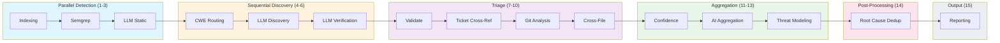

# Architecture

## PhaseGraph (Data-Driven Pipeline Orchestration)

BACO uses a **data-driven PhaseGraph** (`src/scanner/pipeline/orchestrator.rs`) that defines phase execution order, dependencies, and metadata in a single source of truth. This eliminates duplication across the codebase and enables:

- **Centralized phase ordering** - All phases defined in one place with execution metadata
- **Checkpoint/resume support** - Stable phase indices for reliable restart
- **Extensibility** - New phases can be added without modifying multiple files
- **Runtime validation** - Phase consistency checked on startup

## Pipeline Phases

**Core Pipeline (15 phases total: 3 parallel + 12 sequential):**

> **Note:** Phase order is defined in `PhaseGraph::new()` (src/scanner/pipeline/orchestrator.rs:28-53). This table is manually maintained and should be updated when that code changes.

| Phase # | Name | Config gate (default) | Description |
|---------|------|----------------------|-------------|
| 1 | Indexing | Always-on | Index project files |
| 2 | Semgrep | Always-on | Run Semgrep static analysis |
| 3 | LLM Static Analysis | `llm.phases.static_analysis` (API key present) | Analyze files with LLM |
| 4 | CWE Routing | `router.enabled=true` | Route findings to specialized models (opt-in) |
| 5 | LLM Discovery | `llm.phases.discovery` (API key present) | Enrich findings with AI context |
| 6 | LLM Verification | `llm.phases.verification` (API key present) | Verify findings with AI |
| 7 | Validate | `validate.enabled=false` | LLM-as-judge rationale check (CORRECT paper) |
| 8 | Ticket Cross-Reference | `tickets.systems` non-empty | Cross-reference with ticket systems |
| 9 | Git Analysis | Target is a git repository | Analyze Git history |
| 10 | Cross-File Analysis | Always-on | Analyze cross-file dependencies |
| 11 | Confidence Scoring | `scanner.performance.enable_confidence_refinement=false` | Refine confidence scores |
| 12 | AI Aggregation | `llm.phases.aggregation` (API key present) | Aggregate findings with AI |
| 13 | Threat Modeling | Always-on | Generate threat model (STRIDE) |
| 14 | Root Cause Deduplication | `scanner.performance.enable_root_cause_dedup=true` | Deduplicate by root cause |
| 15 | Reporting | Always-on | Generate reports (JSON/HTML/SARIF) |

## Data Flow

```mermaid
flowchart LR
    subgraph Parallel["Parallel Detection (1-3)"]
        direction TB
        A1[Indexing] --> A2[Semgrep] --> A3[LLM Static]
    end

    subgraph Discovery["Sequential Discovery (4-6)"]
        direction TB
        B1[CWE Routing] --> B2[LLM Discovery] --> B3[LLM Verification]
    end

    subgraph Triage["Triage (7-10)"]
        direction TB
        C1[Validate] --> C2[Ticket Cross-Ref] --> C3[Git Analysis] --> C4[Cross-File]
    end

    subgraph Aggregation["Aggregation (11-13)"]
        direction TB
        D1[Confidence] --> D2[AI Aggregation] --> D3[Threat Modeling]
    end

    subgraph PostProcessing["Post-Processing (14)"]
        direction TB
        E1[Root Cause Dedup]
    end

    subgraph Output["Output (15)"]
        direction TB
        F1[Reporting]
    end

    A3 --> B1
    B3 --> C1
    C4 --> D1
    D3 --> E1
    E1 --> F1

    classDef parallel fill:#e1f5fe
    classDef discovery fill:#fff3e0
    classDef triage fill:#f3e5f5
    classDef aggregation fill:#e8f5e9
    classDef postproc fill:#fce4ec
    classDef output fill:#eceff1
    class Parallel parallel
    class Discovery discovery
    class Triage triage
    class Aggregation aggregation
    class PostProcessing postproc
    class Output output
```

**Checkpoint markers**: Checkpoints are saved after each major phase, enabling resume from any point in the pipeline.

## Verification & Calibration Layer

The pipeline includes several verification gates and calibration layers that augment the core phases:

### Citation Verification Gate (Reporting Phase)

Before rendering the final report, deterministic checks verify that all citations (file paths + line ranges) match the scanned source tree. Findings failing this check have their confidence score halved and a note added explaining the discrepancy.

Configured via `[citation_verification] enabled = true` (enabled by default).

### Prior-Runs Store (Discovery Phase)

Cross-run findings history: Confirmed and FalsePositive findings from prior scans (saved under `{output_dir}/runs/`) are injected as skip-lists into discovery prompts. This reduces redundant analysis on subsequent scans of the same codebase.

Configured via `[prior_runs] enabled = true` with `max_runs` controlling how many recent runs to load.

### Org-Context Profile (Discovery + Verification Phases)

Organizational policy profile injected into prompts for calibration. Fields include:
- `stack`: Technology stack (e.g., `["php", "javascript"]`)
- `infra`: Infrastructure (e.g., `["aws", "docker"]`)
- `data_sensitivity`: Data classification (e.g., `"pii"`)
- `secret_storage`: Secret management location (e.g., `"vault"` prevents `${VAULT_TOKEN}` false positives)
- `risk_tolerance`: Risk posture
- `severity_rules`: Per-rule severity overrides

The org-context profile is injected into discovery and verification prompts to reduce false positives tied to the organization's stack, infrastructure, and secret management.

### Domain-Routed Hunt Prompts (Discovery Phase)

Per-attack-class prompt modules from `prompts/hunt/` (injection, auth, authz_absence, xss, path_traversal, crypto, resource, deserialization, memory_safety) selected by target languages and appended to discovery prompts. Each module includes scope/lane discipline sections; the verification prompt has a skeptical self-refutation gate + untrusted-content framing. Hunt prompts are enabled by default (`enable_hunt_prompts = true`).

Configured via `[scanner.performance] enable_hunt_prompts = true`.

### Eval Harness (External)

Known-answer oracle scoring under `eval/` with labeled vulnerable/secure fixture pairs and oracle files. Recall/precision scoring via `src/eval.rs`; end-to-end runs use `BACO_EVAL_FLOOR` env var. See [`eval/README.md`](../eval/README.md).

</content>